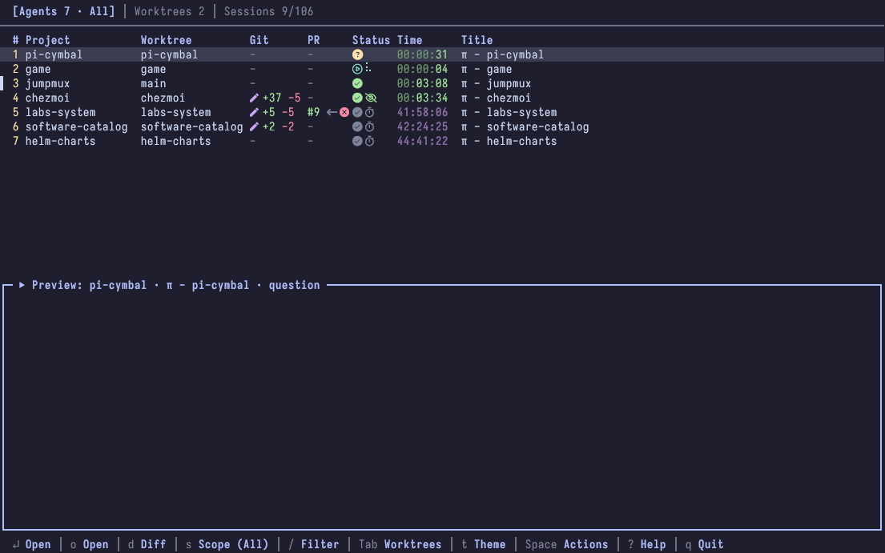
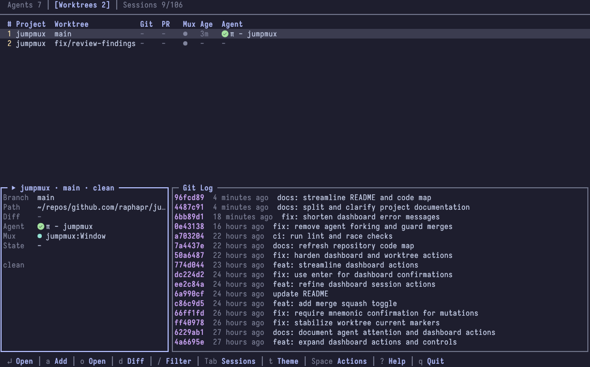
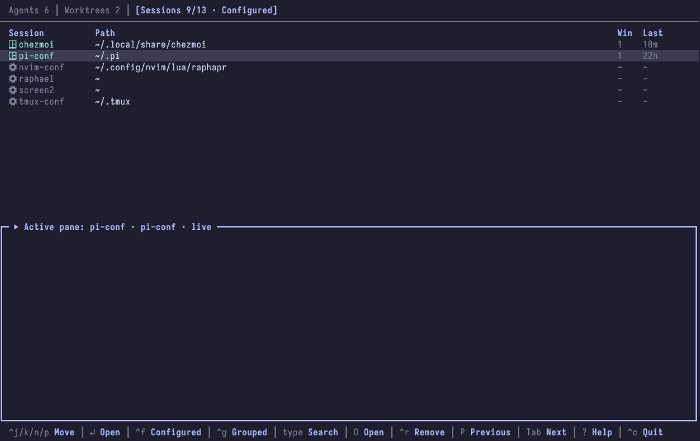

# jumpmux

jumpmux is a terminal dashboard for Git worktrees, Pi agents, and tmux sessions.

Inspired by [workmux](https://github.com/raine/workmux) and [sesh](https://github.com/joshmedeski/sesh).

## Features

<details>
<summary><strong>Agents</strong></summary>

Open Pi panes with Project, Worktree, Git, PR, Status, Time, and Title columns.



</details>

<details>
<summary><strong>Worktrees</strong></summary>

View worktrees from the current repository with Project, Worktree, Git, PR, Mux, Age, and Agent columns.



</details>

<details>
<summary><strong>Sessions</strong></summary>

Browse configured locations, discovered repositories, and live tmux sessions with Session, Path, Windows, and Last-attached columns.



</details>

## Requirements

- Go 1.24+ to install from source
- git
- tmux
- [Pi](https://pi.dev)
- Optional: [Nerd Font](https://www.nerdfonts.com/), [Worktrunk](https://worktrunk.dev/), [GitHub CLI](https://cli.github.com/)

## Install

Download the Linux or macOS archive for your amd64 or arm64 system from [GitHub Releases](https://github.com/raphapr/jumpmux/releases), extract `jumpmux` into your `PATH`, then run:

```console
jumpmux setup
```

To install from source instead:

```console
go install github.com/raphapr/jumpmux@latest
jumpmux setup
```

`jumpmux setup` installs or updates `jumpmux-status.ts` in Pi's global extensions directory. Run it again after upgrading jumpmux, then restart Pi or run `/reload` in each open Pi session.

The extension reports each pane's lifecycle state for the dashboard.

## Quick start

```console
jumpmux
```

## Documentation

- [Dashboard](docs/dashboard.md): keys, actions, previews, Git status, pull requests, and themes
- [Command line](docs/cli.md): commands and confirmation behavior
- [Configuration](docs/configuration.md): config file reference, backends, previews, sessions, and agent attention
- [Development](docs/development.md): source layout and release process

## Scope

jumpmux makes Git worktrees, Pi agents, and tmux sessions visible and easy to navigate in one TUI. It reads agent, Git, PR, session, and tmux state; switches panes and sessions; creates tmux windows and configured sessions; manages worktrees; and opens PRs.

jumpmux does not orchestrate agents, assign tasks, or manage multi-agent workflows. It supports only Pi agents and tmux.
